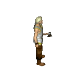
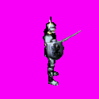

# Описание

Форматы и плагины для распаковки и просмотра файлов изображений игр серии Златогорье. Описание форматов в шаблонах .bt для программы 010Editor.

## Краткое описание форматов

В игре **Златогорье (2001)** используеься стандартная для начала 90х-2000х годов двухмерная [изометрическая графика](https://ru.wikipedia.org/wiki/%D0%98%D0%B7%D0%BE%D0%BC%D0%B5%D1%82%D1%80%D0%B8%D1%87%D0%B5%D1%81%D0%BA%D0%B0%D1%8F_%D0%B3%D1%80%D0%B0%D1%84%D0%B8%D0%BA%D0%B0_%D0%B2_%D0%BA%D0%BE%D0%BC%D0%BF%D1%8C%D1%8E%D1%82%D0%B5%D1%80%D0%BD%D1%8B%D1%85_%D0%B8%D0%B3%D1%80%D0%B0%D1%85) на основе изображений, полученных из трехмерных моделей. Все изображения в игре хранятся в формате [BMP](https://ru.wikipedia.org/wiki/BMP) и запакованы в игровые архивы с расширением (paxx.)nrm. Для сжатия изображений и других файлов применяется [RLE](https://ru.wikipedia.org/wiki/%D0%9A%D0%BE%D0%B4%D0%B8%D1%80%D0%BE%D0%B2%D0%B0%D0%BD%D0%B8%D0%B5_%D0%B4%D0%BB%D0%B8%D0%BD_%D1%81%D0%B5%D1%80%D0%B8%D0%B9).

Анимация персонажей сделана на основе [спрайтов](https://ru.wikipedia.org/wiki/%D0%A1%D0%BF%D1%80%D0%B0%D0%B9%D1%82_(%D0%BA%D0%BE%D0%BC%D0%BF%D1%8C%D1%8E%D1%82%D0%B5%D1%80%D0%BD%D0%B0%D1%8F_%D0%B3%D1%80%D0%B0%D1%84%D0%B8%D0%BA%D0%B0)). В отдельном файле на кадого персонажа с каждым видом оружия и брони (если есть), противника или npc хранятся кадры движения по 8 кадров в каждом из 8 направлений. Размер одного кадра спрайта персонажа 125x125 пикселей и 1000x1000 пикселей весь спрайт. Также отдельно на каждое тело хранятся тени, которые анимированы аналогичным способом.

### Форматы
 № | Формат файла       | Шаблон (010Editor)     |    Описание |
| :--- | :--------- | :----------- | :---------- |
| 1 | .nrm        | [NRM.bt](https://github.com/AlexKimov/goldenland-file-formats/blob/master/formats/010editor/NRM.bt)  |   архив игровых ресурсов Златогорье 1 |

    Как использовать шаблоны 010Editor
    1. Нужен 010Editor.
    2. Открыть нужный вам .nrm файл в программе. Меню File - Open File...
    3. Применить шаблон NRM.bt. Меню Templates - Open Template и Run Template.

## Инструменты

| № | Плагин       | Программа | Описание |  
| :--- | :--------- | :----------- | :---- | 
| 1 | [unpack_nrm.bms](https://github.com/AlexKimov/goldenland-file-formats/blob/master/sripts/quickbms/unpack_nrm.bms) | Quickbms | Распаковка файлов ресурсов .nrm  Златогорье 1 |

    Как использовать
    1. Нужен quickbms https://aluigi.altervista.org/quickbms.htm
    2. Для запуска в репозитории лежит bat файл с настройками, нужно открыть его и задать свои пути: до места, где находится quickbms, папки с игрой и места куда нужно сохранить результат.
    3. Запустить процесс через bat файл или вручную (задав свои параметры для запуска quickbms, документация на английском есть здесь https://aluigi.altervista.org/papers/quickbms.txt ). 
