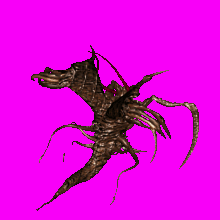
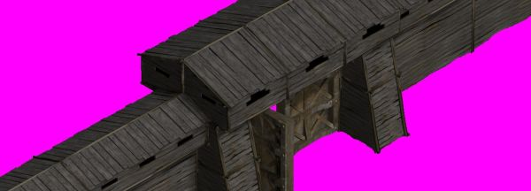

# Описание

Форматы и плагины для распаковки и просмотра файлов изображений игр серии Златогорье. Описание форматов в шаблонах .bt для программы 010Editor.

## Краткое описание файлов игры

### Игровые ресурсы

Файлы запакованы в игровые архивы с расширением **(paxx.)nrm**, для сжатия данных применяется [RLE](https://ru.wikipedia.org/wiki/%D0%9A%D0%BE%D0%B4%D0%B8%D1%80%D0%BE%D0%B2%D0%B0%D0%BD%D0%B8%D0%B5_%D0%B4%D0%BB%D0%B8%D0%BD_%D1%81%D0%B5%D1%80%D0%B8%D0%B9). Поскольку файлы изображений содержат маску из одного цвета, то примененный тип сжатия позволяет эффективно сжать данные (в распакованном виде архивы весят ~1.8 Гб). 
   
### Графика

В игре **Златогорье (2001)** используется классическая для 90х-2000х годов двухмерная [изометрическая графика](https://ru.wikipedia.org/wiki/%D0%98%D0%B7%D0%BE%D0%BC%D0%B5%D1%82%D1%80%D0%B8%D1%87%D0%B5%D1%81%D0%BA%D0%B0%D1%8F_%D0%B3%D1%80%D0%B0%D1%84%D0%B8%D0%BA%D0%B0_%D0%B2_%D0%BA%D0%BE%D0%BC%D0%BF%D1%8C%D1%8E%D1%82%D0%B5%D1%80%D0%BD%D1%8B%D1%85_%D0%B8%D0%B3%D1%80%D0%B0%D1%85) на основе изображений, полученных из трехмерных моделей. Большая часть изображений в игре в формате [8 бит](https://ru.wikipedia.org/wiki/8_%D0%B1%D0%B8%D1%82_(%D0%BA%D0%BE%D0%BC%D0%BF%D1%8C%D1%8E%D1%82%D0%B5%D1%80%D0%BD%D0%B0%D1%8F_%D0%B0%D1%80%D1%85%D0%B8%D1%82%D0%B5%D0%BA%D1%82%D1%83%D1%80%D0%B0)). Для хранения графики используются форматы: [bmp](https://ru.wikipedia.org/wiki/BMP), [jpeg](https://ru.wikipedia.org/wiki/JPEG) и собственный формат **itd**. Первый применяется для персонажей, текстур локаций, строений, меню игры, второй для файлов загрузочного экрана. 

Анимация персонажей сделана на основе [спрайтов](https://ru.wikipedia.org/wiki/%D0%A1%D0%BF%D1%80%D0%B0%D0%B9%D1%82_(%D0%BA%D0%BE%D0%BC%D0%BF%D1%8C%D1%8E%D1%82%D0%B5%D1%80%D0%BD%D0%B0%D1%8F_%D0%B3%D1%80%D0%B0%D1%84%D0%B8%D0%BA%D0%B0)). В отдельных файлах на каждого персонажа, противника или неигрового персонажа хранятся кадры движения по 8 кадров на одну анимацию (бег, атака, неподвижнок состояние и т.д.) в 8 различных направлениях, аналогичным образом сделаны тени. Размер одного кадра спрайта персонажа игрока 125x125 пикселей и до 220x220 пикселей для управляемых компьютером. При отрисовке персонажа его изображение и тень совмещаются в единую анимацию.

Объекты локации, например, здания, в также некоторые локации карты сделаны в виде отдельного изображения поверх фона. 

#### Параметры

Файлы **itd** хранят параметры предметов инвентаря героя и изображения этих предметов.

### Скрипты

Часть действий персонажей (диалоги) вынесена в отдельные файлы с расширением script. Файл задает последовательность диалогов и сам текст.

### Карта

Глобальная карта разбита на отдельные регионы (локации). Внешний вид локации, т.е расположение спрайтов на ней, хранится в файлах в папке MapLoc. Файл локации состоит из набора текстур фона, набора объектов, которые размещаются поверх фона, параметров отдельных тайлов (проходимость и т.п.).

### Другое

В папке игры (зависит от версии игры?) можно найти отдельные файлы, которые не связаны непосредственно с игрой: логи сборки файлов, комментарии разработчиков и т.п..

## Форматы

### Структура

**NRM**

    - Сигнатура файла (18 байтов)
    - Файлы (для каждого файла одна структура)
      -- Заголовок файла
        --- Код (5 байтов)
        --- Размер данных вместе с заголовком (4 байта)
        --- Размер в распакованном виде (4 байта)
        --- Длина названия (4 байта)
        --- Название файла
      -- Данные файла

### Шаблоны

 № | Формат файла       | Шаблон (010Editor)     |    Описание |
| :--- | :--------- | :----------- | :---------- |
| 1 | .nrm        | [NRM.bt](formats/010editor/NRM.bt)  |   архив игровых ресурсов Златогорье 1 |
| 2 | .idt        | [IDT.bt](formats/010editor/IDT.bt)  |  Предметы инвентаря и их параметры |
| 3 | .map       | [MAP.bt](formats/010editor/MAP.bt)  | Локация и объекты на ней |

    Как использовать шаблоны 010Editor
    1. Нужен 010Editor.
    2. Открыть нужный вам .nrm файл в программе. Меню File - Open File...
    3. Применить шаблон NRM.bt. Меню Templates - Open Template и Run Template.

## Инструменты

| № | Плагин       | Программа | Описание |  
| :--- | :--------- | :----------- | :---- | 
| 1 | [unpack_nrm.bms](scripts/quickbms/unpack_nrm.bms) | Quickbms | Распаковка файлов ресурсов .nrm  Златогорье 1 | 
| 2 | [fmt_heath_nrm.py](noesis/fmt_heath_nrm.py) | Noesis | Распаковка файлов ресурсов .nrm  Златогорье 1 |
| 3 | [fmt_heath_itd.py](noesis/fmt_heath_itd.py) | Noesis | Просмотр изображений из файлов .itd  Златогорье 1 |
| 4 | [itd.py](/plugins/gimp/itd.py) | Gimp | Просмотр изображений из файлов .itd  Златогорье 1 | 

    Как использовать quickbms скрипты
    1. Нужен quickbms https://aluigi.altervista.org/quickbms.htm
    2. Для запуска в репозитории лежит bat файл с настройками, нужно открыть его и задать свои пути: до места, где находится quickbms, папки с игрой и места куда нужно сохранить результат.
    3. Запустить процесс через bat файл или вручную (задав свои параметры для запуска quickbms, документация на английском есть здесь https://aluigi.altervista.org/papers/quickbms.txt ). 
    
    Как использовать Noesis плагины
    1. Скачать Noesis https://richwhitehouse.com/index.php?content=inc_projects.php&showproject=91 .
    2. Скопировать скрипт в папку ПапкасNoesis/plugins/python.
    3. Открыть Noesis.
    4. Открыть файл через File-Open. 
    
    Как использовать gimp плагины
    1. Поместить плагин в папку Users\"Имя текущего пользователя"\AppData\Roaming\GIMP\2.10\plug-ins
    2. Запустить, открыть файл через меню файл-открыть.
